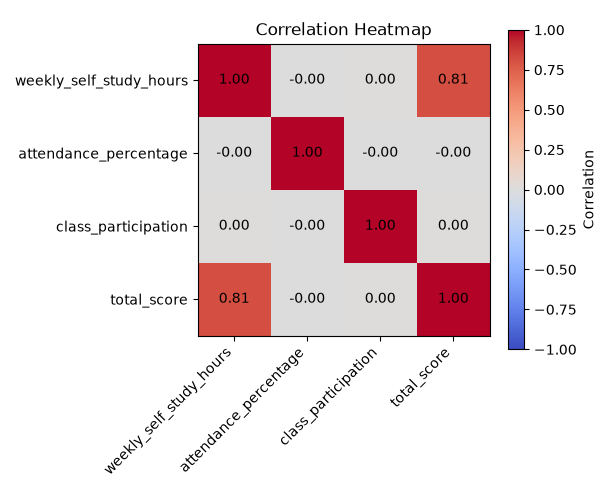
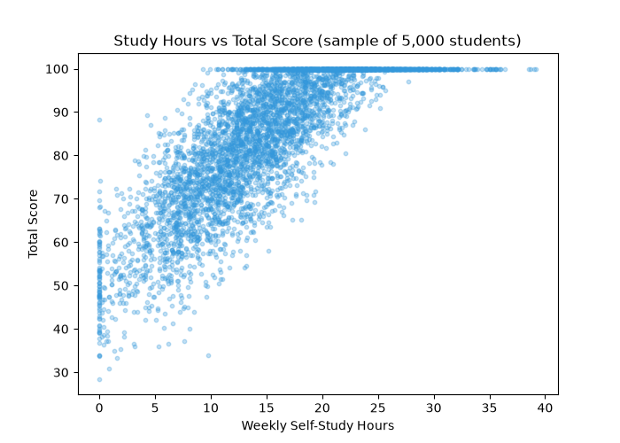
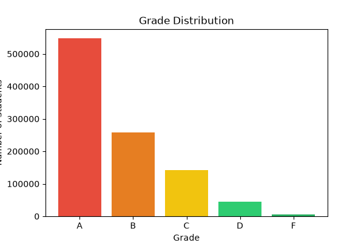
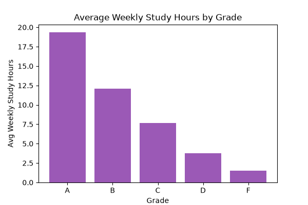

# Student Performance Analyzer

Analysis of a 1,000,000-record student performance dataset to identify what actually drives academic outcomes, using Python, pandas, and NumPy.

## Key Finding
Weekly self-study hours has a **strong correlation (0.81)** with total score — by far the strongest predictor of performance. Attendance percentage and class participation show **near-zero correlation** (-0.001, 0.0007) with score, despite being commonly assumed to matter.

At-risk students (bottom 1.5 std deviations, z-score < -1.5) study an average of **4.68 hrs/week**, compared to the overall average of **15.03 hrs/week** — while their attendance and participation are nearly identical to the overall average. This suggests self-study time, not classroom presence, is the key differentiator for struggling students.

## Dataset
[Student Performance Dataset](https://www.kaggle.com/datasets/nabeelqureshitiii/student-performance-dataset) — 1M synthetic student records with weekly self-study hours, attendance %, class participation score, total score, and letter grade.

## Tools
- Python, pandas, NumPy, Matplotlib
- Jupyter Notebook

## Analysis Performed
- Data cleaning and integrity checks (missing values, duplicates)
- Correlation analysis between study habits and performance
- Grade distribution analysis
- At-risk student identification using z-score thresholding
- Comparative analysis of at-risk vs. average student behavior

## Visualizations
| Correlation Heatmap | Study Hours vs Score |
|---|---|
|  |  |

| Grade Distribution | Avg Study Hours by Grade |
|---|---|
|  |  |

## How to Run
```bash
pip install pandas numpy matplotlib kagglehub
jupyter notebook analyzer.ipynb
```

## Summary Stats
See `summary_report.csv` for exported metrics.
